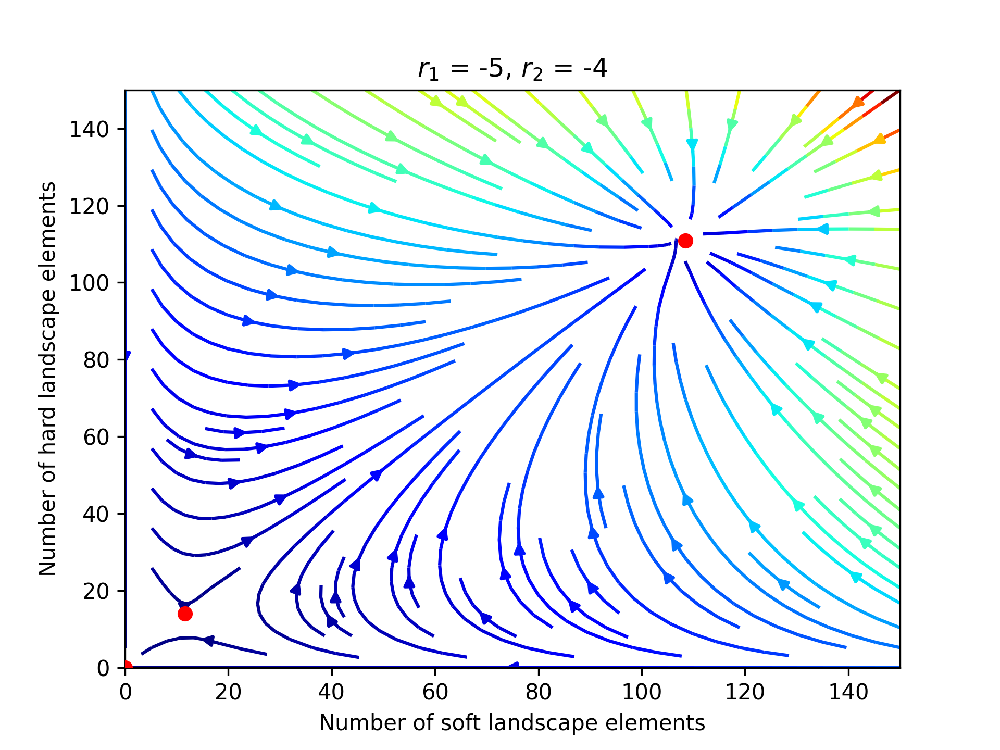

# Mutualism Visualization

This is a little interactive demo of the type II functional response mutualism model described by Algarra et al 
here https://ifisc.uib-csic.es//~jramasco/text/ecol_eqs.pdf.


## Landscape design

These visualisations can also be used as a way to think about landscape design.



## Run the notebook

```bash
pip install -r requirements.txt
python -m jupyter notebook
```

## Other references
https://mathematica.stackexchange.com/questions/74214/the-lotka-volterra-predator-prey-model

https://scipy-cookbook.readthedocs.io/items/LoktaVolterraTutorial.html

https://github.com/kieranmrhunt/curved-quivers